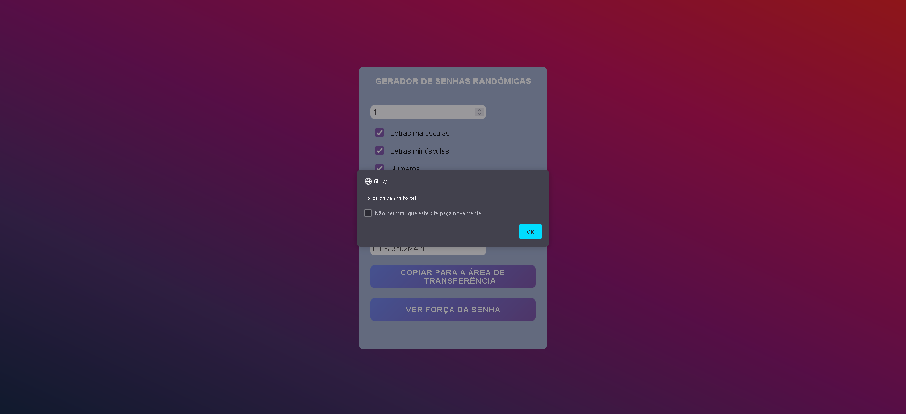

# Gerador de Senha
Projeto de um gerador de senhas randômicas, desenvolvido na disciplina de Programação Web, sob orientação do Prof. Edkallen. Utiliza HTML, CSS e JavaScript.

Link do Projeto no Netlify:
https://deploy-preview-1--fanciful-gecko-89f985.netlify.app/

